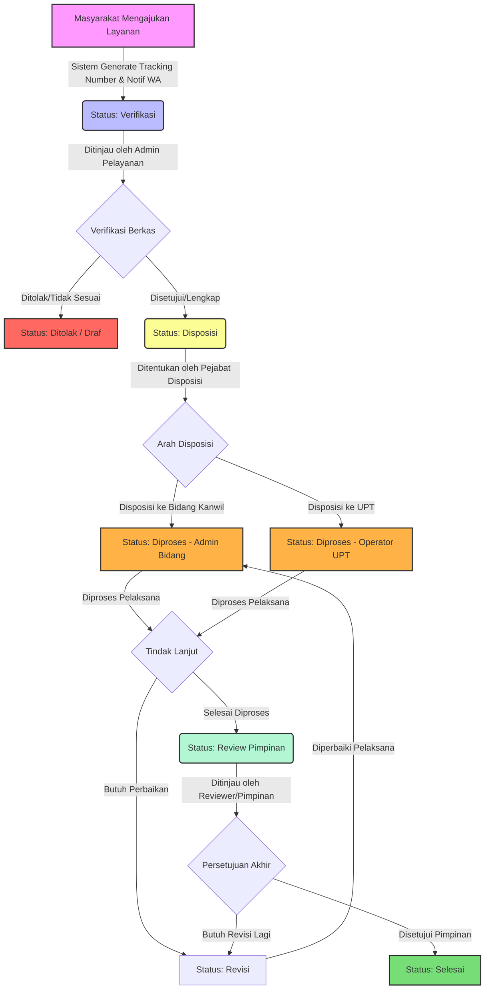

# Dokumentasi Lengkap Aplikasi STARPAS Banten

STARPAS (Sistem Terpadu Aksi Responsif) Kanwil Ditjenpas Banten adalah platform digital terintegrasi yang dirancang untuk mengelola dan merespons berbagai layanan publik di lingkungan Kantor Wilayah Direktorat Jenderal Pemasyarakatan Banten secara cepat, transparan, dan akuntabel. Aplikasi ini dilengkapi dengan integrasi WhatsApp gateway untuk mempermudah masyarakat dalam melacak status pengajuan secara *real-time*.

---

## 1. Arsitektur & Teknologi Aplikasi

Aplikasi dibangun menggunakan stack modern berikut:
*   **Backend:** Laravel 12.0 (PHP >= 8.4)
*   **Frontend:** Livewire v3 (untuk interaktivitas dinamis) & Blade Templating
*   **Database:** MySQL / SQLite
*   **WhatsApp Gateway:** Fonnte API (untuk pengiriman notifikasi otomatis)
*   **Mobile Companion:** Aplikasi Android WebView terintegrasi dengan Firebase Cloud Messaging (FCM) untuk push notifications.

---

## 2. Struktur Peran Pengguna (User Roles)

STARPAS Banten membagi hak akses ke dalam beberapa peran yang saling terhubung dalam alur kerja (workflow) pelayanan:

| Peran (Role) | Deskripsi Tanggung Jawab |
| :--- | :--- |
| **Publik (Masyarakat)** | Pengguna umum yang mengajukan permohonan layanan (Perizinan, Pengaduan, Informasi) dan melacak statusnya via web atau WhatsApp. |
| **Admin Pelayanan** | Petugas garda depan (front office) yang memverifikasi awal kelayakan dan kelengkapan berkas permohonan yang masuk. |
| **Pejabat Disposisi** | Pejabat berwenang di tingkat Kanwil yang menentukan disposisi permohonan (diarahkan ke Tim/Bidang di Kanwil atau ke UPT terkait). |
| **Admin Bidang** | Pelaksana teknis di tingkat Bidang/Divisi di Kantor Wilayah (Kanwil) yang menindaklanjuti dan menyelesaikan permohonan. |
| **Operator UPT** | Pelaksana teknis di tingkat Unit Pelaksana Teknis (Lapas, Rutan, Bapas, Rupbasan) yang menindaklanjuti dan menyelesaikan permohonan. |
| **Reviewer / Pimpinan** | Pimpinan yang melakukan verifikasi akhir hasil kerja pelaksana sebelum permohonan dinyatakan selesai. |
| **Super Admin** | Pengelola sistem utama dengan hak akses penuh ke data master (UPT, Layanan, Bidang), pengaturan token WA, dan manajemen hak akses user. |

---

## 3. Alur Jalannya Pelaporan Pelayanan (Workflow)

Seluruh pengajuan layanan melalui rangkaian status terstruktur berikut:

### Penjelasan Detil Langkah Alur Pelayanan:

#### Tahap 1: Pengajuan (Submit) oleh Pemohon
1. Pemohon mengunjungi portal STARPAS Banten dan memilih salah satu jenis layanan:
   * **Layanan Perizinan:** Izin magang, penelitian, kunjungan khusus, dll. (SLA Default: 5 Hari).
   * **Layanan Pengaduan:** Pelaporan pelanggaran, keluhan pelayanan, dll. (SLA Default: 3 Hari).
   * **Layanan Informasi:** Permintaan data publik, salinan dokumen, dll. (SLA Default: 7 Hari).
2. Pemohon mengisi formulir, mengunggah identitas (KTP/KTM), melampirkan berkas pendukung, dan memasukkan nomor kontak WhatsApp aktif.
3. Setelah klik kirim, sistem melalui [WorkflowService](file:///d:/Dokumen/GitHub/Starpas-Banten/app/Services/WorkflowService.php) akan:
   * Menghasilkan **Nomor Tracking unik** dengan format prefix (misal: `PRZ-2606-0001` untuk perizinan).
   * Membuat rekaman data permohonan baru dengan status awal `verification` (Verifikasi).
   * Mengirim notifikasi WhatsApp otomatis ke pemohon via [FonnteService](file:///d:/Dokumen/GitHub/Starpas-Banten/app/Services/FonnteService.php) yang berisi konfirmasi pengajuan dan nomor tracking.

#### Tahap 2: Verifikasi Awal
1. **Admin Pelayanan** menerima notifikasi pengajuan baru di Inbox mereka.
2. Admin Pelayanan memeriksa kelengkapan berkas fisik/unggahan dan kesesuaian informasi.
3. Keputusan Admin Pelayanan:
   * **Setujui (Approve):** Status naik menjadi `disposition` (Disposisi), diteruskan ke Pejabat Disposisi.
   * **Tolak (Reject):** Status diubah menjadi `rejected` (Ditolak) disertai alasan penolakan. Pemohon mendapatkan notifikasi WA bahwa laporannya ditolak.
   * **Kembalikan (Revise):** Status diubah menjadi `revision` (Revisi), dikembalikan ke pemohon untuk melengkapi kekurangan berkas.

#### Tahap 3: Disposisi
1. **Pejabat Disposisi** membuka permohonan berstatus `disposition`.
2. Pejabat meninjau detail permohonan dan menentukan pelaksana tindak lanjut:
   * **Didisposisikan ke Bidang Kanwil:** (misal: Bidang Pembinaan, Bidang Keamanan, dll.)
   * **Didisposisikan ke UPT:** (misal: Lapas Kelas IIA Serang, Rutan Kelas I Tangerang, dll.)
3. Pejabat menulis catatan disposisi, lalu mengirimkannya. Sistem mengubah status permohonan menjadi `processing` (Diproses) dan mencatat instansi tujuan disposisi di tabel `permohonan_disposisis`.

#### Tahap 4: Tindak Lanjut (Processing)
1. **Admin Bidang** atau **Operator UPT** (sesuai tujuan disposisi) akan melihat permohonan masuk ke Inbox mereka.
2. Pelaksana menindaklanjuti perintah disposisi, melakukan verifikasi lapangan, menyiapkan surat balasan, atau memproses izin yang diminta.
3. Setelah selesai dikerjakan, pelaksana mengunggah draf jawaban/surat keputusan dan mengubah status ke `review` (Review Pimpinan).

#### Tahap 5: Review Pimpinan & Penyelesaian (Completed)
1. **Reviewer** atau **Pimpinan** menerima notifikasi review di Inbox mereka.
2. Pimpinan memeriksa draf jawaban atau berkas hasil tindak lanjut pelaksana.
3. Keputusan Pimpinan:
   * **Setujui (Approve):** Berkas final disetujui, sistem mengubah status menjadi `completed` (Selesai). Pemohon menerima notifikasi WhatsApp otomatis bahwa pengajuannya telah **SELESAI** beserta tautan untuk mengunduh dokumen hasil jika ada.
   * **Kembalikan (Revise):** Jika hasil kerja dirasa belum memadai, Pimpinan mengembalikan status ke `revision` (Revisi) agar diperbaiki oleh pelaksana.

---

## 4. Struktur Database & Model Data Utama

Relasi data diatur melalui tabel-tabel utama berikut:

1.  **`users`**: Menyimpan data akun pengguna internal beserta asosiasi UPT (`upt_id`) dan Bidang (`bidang_id`).
2.  **`master_layanans`**: Berisi jenis-jenis layanan, kategori (Perizinan/Pengaduan/Informasi), serta durasi SLA (Service Level Agreement) dalam satuan hari kerja.
3.  **`master_upts`**: Menyimpan daftar Unit Pelaksana Teknis se-Banten yang aktif untuk tujuan disposisi.
4.  **`master_bidangs`**: Menyimpan daftar Bidang/Divisi kerja internal di Kantor Wilayah.
5.  **`permohonans`**: Menyimpan informasi transaksi pengajuan layanan dari masyarakat (payload data berbentuk JSON).
6.  **`permohonan_timelines`**: Log riwayat perubahan status permohonan secara berurutan, lengkap dengan catatan perubahan dan pelaksana yang mengubahnya.
7.  **`permohonan_disposisis`**: Log pencatatan tujuan disposisi permohonan ke Bidang atau UPT tertentu.

---

## 5. Integrasi WhatsApp (Fonnte)

Sistem menggunakan Fonnte API untuk mengirim notifikasi secara langsung ke WhatsApp pemohon. Template pesan diatur di basis data dan dikirimkan saat terjadi transisi status berikut:

*   **Penerimaan Permohonan:** Dikirimkan sesaat setelah pemohon mengirimkan formulir (Berisi nomor tracking).
*   **Update Status Permohonan:** Dikirimkan setiap kali status berubah (misalnya ketika status berpindah dari *Verifikasi* ke *Diproses*, atau ketika dialihkan untuk *Revisi*).
*   **Permohonan Selesai:** Dikirimkan saat Pimpinan memberikan persetujuan akhir (disertai catatan hasil akhir pelayanan).

---

## 6. Aplikasi Pendukung: Android WebView
STARPAS Banten menyediakan aplikasi mobile Android yang berjalan di atas WebView untuk memberikan kemudahan akses bagi aparatur sipil negara (ASN) maupun masyarakat:
*   **Push Notifications:** Menggunakan Firebase Cloud Messaging (FCM) untuk mengirimkan notifikasi instan langsung ke perangkat Android ketika ada permohonan baru atau pembaruan status.
*   **Offline Support:** Memiliki deteksi konektivitas bawaan yang secara cerdas menampilkan halaman peringatan kustom saat perangkat kehilangan koneksi internet.
